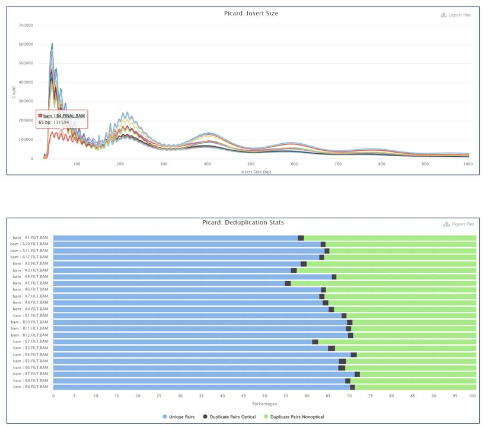
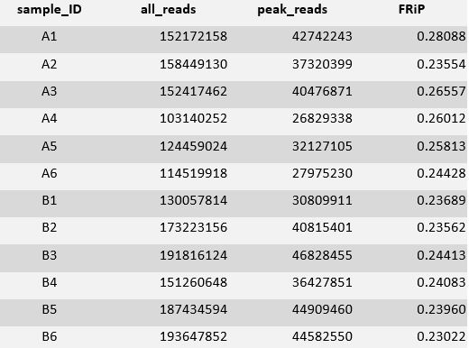
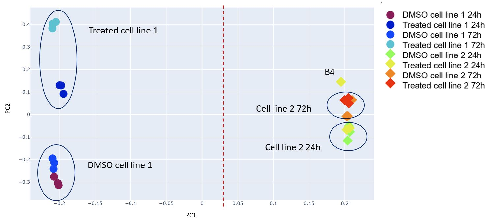
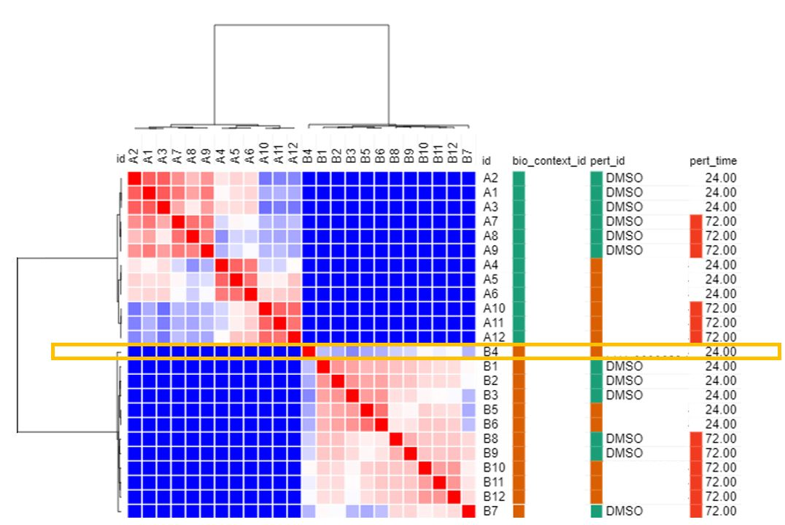
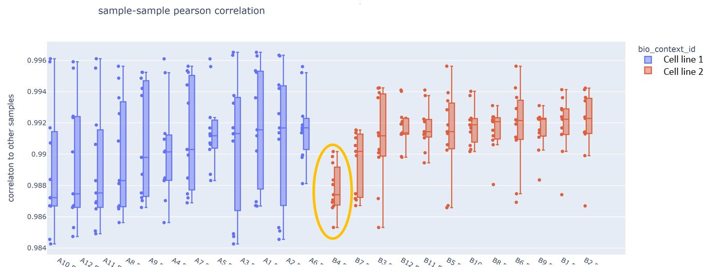

# Example: QC test with outlier

In this example, we compare some samples from random data with 2 cell lines, treated at 24h and at 72h.

The first outputs from the package multiqc gives the insert size and the deduplication stats. Overall, it has the classical ATAC-seq pattern (nucleosome free peak, dinucleosome peak, trinucleosome peak, etc.)
However, the sample B4 has its nucleosome free peak counts lower than +1 nucleosome counts. 

The snapshot from the FRiP scores shows typical for an ATACseq experiment.

The next step is the Principal Component Analysis (PCA) which is a dimensionality reduction. PC1 clusters by cell line with the cell line 1 in the left and cell line 2 on the right. PC2 clusters by treatment for the cell line 1 and by time for the cell line 2. Again, B4 is outside of its cluster (treated cell line 2 at 24h). 

Another QC measure sanity check is with heatmap gives us an overall visual of the sample-to-sample correlations. The samples are clustered depending on their correlations. We can observe a strong separation between cell lines (bio_context_id is split between green and red). For the cell line 1 (green), we can see that samples cluster by treatment (pert_id split between green and red). And then samples are split by time. It is coherent with the results from the PCA. The cell line 2 (red) clusters first by time and then by treatment in accordance with the results from the PCA. One more time, the sample B4 is not with the other samples from the treated cell line 2 at 24h abd by consequence shos less agreement with the other replicates.

The boxplot gives a quantitative look of potentials outliers within cell lines.	We only computes correlation between the samples of the same cell line here. The cell line 1 is in blue and the cell line 2 is in red.
Even though correlation values are greater than 98%, which is really high compared to some previous results, B4 has lower values that the other samples from cell line 2 correlation and the third quartile is lower than the 1st quartile of the other samples. Another evidence that B4 has less overlap with the other samples.

