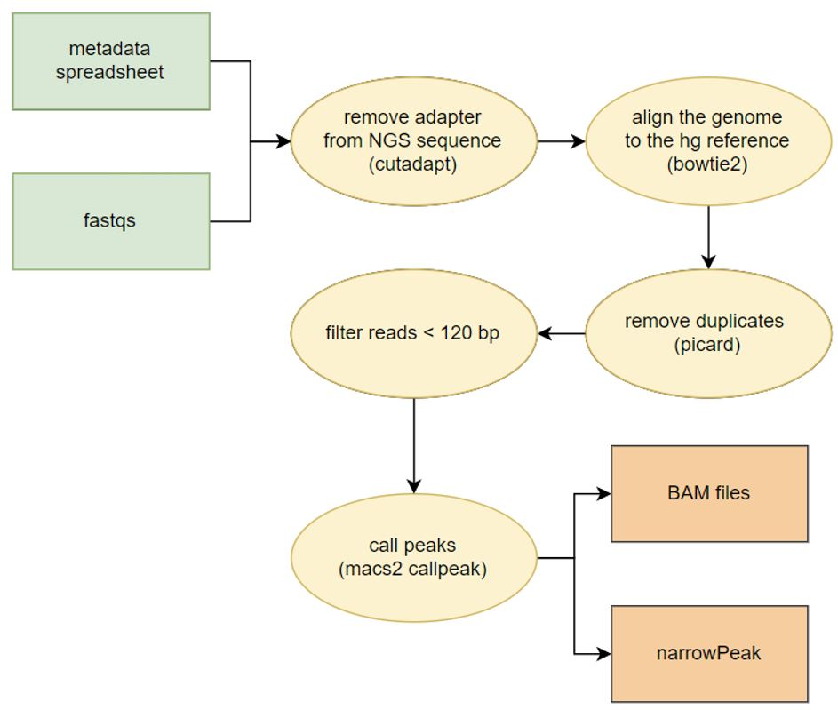
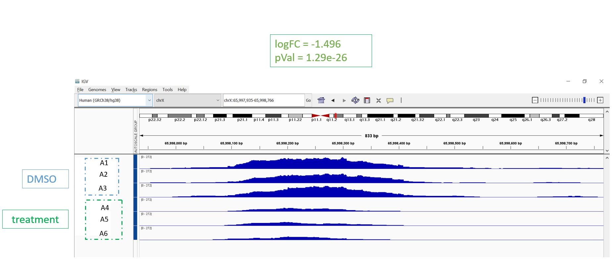
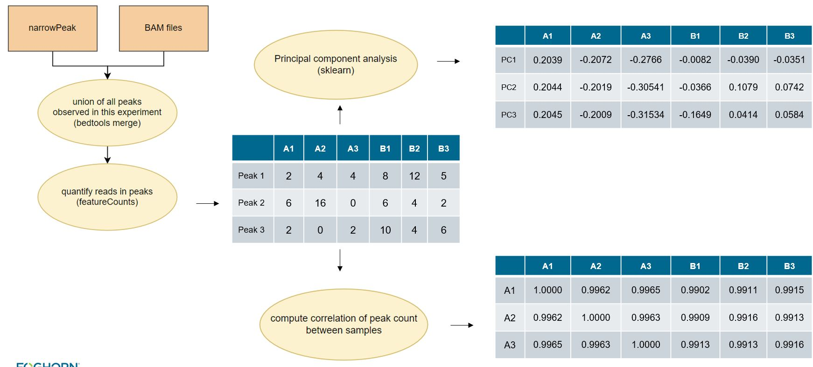
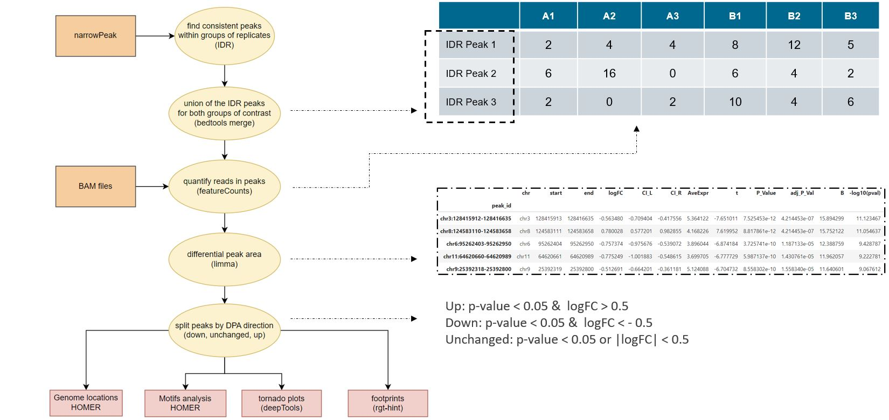
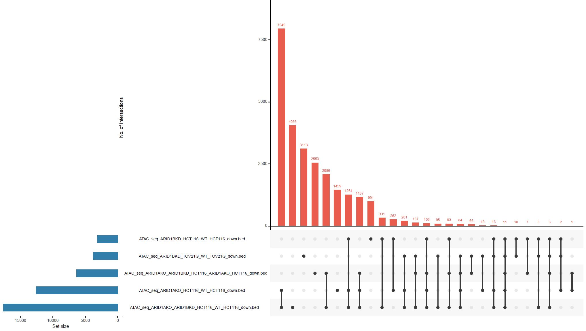
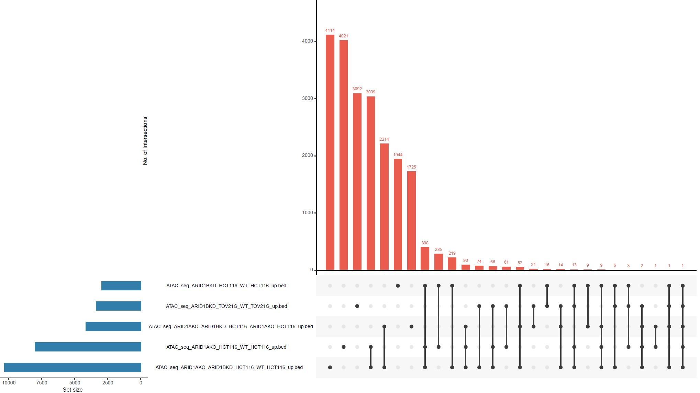
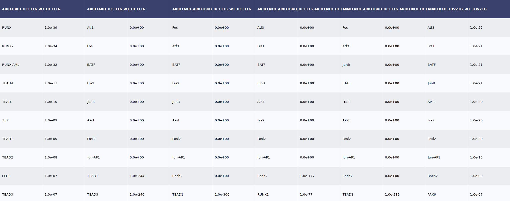
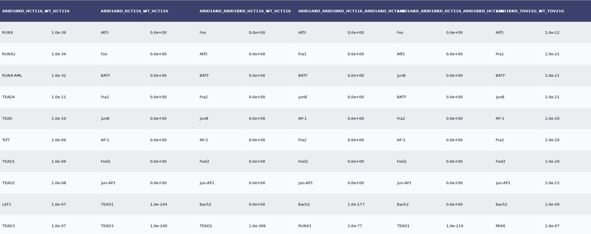

# Background

DNA replication and gene transcription occur when the higher-order structure of DNA - heterochromatin - is unpacked creating regions of open chromatin. Identifying these open regions is crucial because they often hold the keys to how genes are controlled and aid understanding the genome's regulatory landscape.

Assay for Transposase-Accessible Chromatin using sequencing (ATAC-seq) is a powerful technique that has revolutionized our understanding of the genome's regulatory landscape. It uses sequencing adapters and a cutting enzyme to fragment and tag DNA in the open chromatin regions, after purification, the library can be prepared (including PCR amplification) and sequenced using next-generation sequencing techniques.

# Overview

Here we present a computational pipeline and related techniques for analyzing ATAC-seq data.  The ultimate goal of this pipeline is identify genomic regions whose chromatin accessibility changes when a biological system is perturbed (using a compound or a genetic alteration i.e. CRISPR).  Here we will walk through an example of the outputs of this pipeline using publicly available data to illustrate the main outputs and how we use them.

# Data

The standard pipeline was run on publicly available data from paper "[Chromatin accessibility underlies synthetic lethality of SWI/SNF subunits in ARID1A-mutant cancers](https://elifesciences.org/articles/30506#content)" looking for potential PD markers as well as what an ATAC-seq profile looks like. This paper has ATACseq results of ARID1A-/- cancer cell lines (native or CRISPR knockout) with ARID1B knockdown. 

**Data from GEO series**:  [link](https://www.ncbi.nlm.nih.gov/geo/query/acc.cgi?acc=GSE101975)

Overview of experiment:
* Biological context (N=2):  TOV21G, HCT116
* wild type and modified with stable ARID1A knockout
* Perturbagens (N=1):  shRNA knockdown of ARID1B
* Negative control (N=1):  wild type / untreated
* Replicates:  N=2

### HCT116 (ACH-000971)
* WT: SRR5876158 & SRR5876159
* ARID1B knockdown: SRR5876160 & SRR5876161
* ARID1A knockout: SRR5876162 & SRR5876163
* ARID1A knockout ARID1B knockdown:SRR5876164 & SRR5876165

### TOV21G (ACH-000885)
* WT: SRR5876661 & SRR5876662
* ARID1B knockdown: SRR5876663 & SRR5876664

# Description of the pipeline

The overall ATACseq architecture is split between two parts: the alignment and the downstream analysis.  Alignment focuses on alignment of reads  the genome and identification of regions of higher read counts - "peaks".  Downstream analysis focuses on comparisons across/between samples.

## Alignment

The alignment includes steps to remove adapters, align to the genome, remove duplicates and filter to reads less than 120 bp in length (to retain fragments that represent open regions). We obtain two major output files that are the BAM files (aligned reads) and BED/narrowPeak files (identifying regions of open chromatin, "peaks").

You can find a more detailed version of the data flow diagram of the aligmnent [here](https://github.com/FoghornTherapeutics/FHT-ATACseq-pipeline/blob/main/code/alignment/README.md). 

## Analysis

As mentioned one goal of the ATACseq pipeline is to identifiy regions where the chromatin accessibility is changing.  An example of a region like this is shown below in a genome browser view.  The upper three traces correspond to DMSO (vehicle/untreated) samples, and the lower three traces correspond to samples treated with a compound.  The coverage of reads in the upper three traces is consistently higher than in the lower three, indicating that chromatin accessibility has decreased as a result of this treatment.

It is useful to contrast RNA-seq with ATAC-seq to illustrate a challenge of analyzing ATAC-seq data.  In RNA-seq, generally, one uses the predefined exons and then counts the reads that overlap with exons to generate gene expression read counts.  For ATAC-seq there are no pre-defined regions analogous to exons that can be used for generating a count matrix, so an early step of the analysis is to identify these regions (aka peaks).  These peaks are identified for individual samples, and then need to be reconciled across samples in order to allow subsequent comparisons / aggregate analysis across samples.

Once we have identified these common regions aka peaks we can generate a count matrix, and then we can look at PCA (Principal Component Analysis) and at sample-to-sample correlations.  One important aspect of these analyses is for quality control to look for individual samples that are clear outliers from the other replicates.

Before we dive in the second part, we define some terminology. We call each sample a replicate, and replicates with the same conditions (treatment, cell lines, time, dose, etc.) are a group.  The comparison of two groups (i.e., test vs. negative control; treated vs. untreated etc.) is called a contrast.  Regions of interest are also called "peaks" for short and are genomic locations where open chromatin has been observed for 1 or more samples.

For a given contrast we define the peaks as the union of the peaks for the groups within the contrast.  The peaks in the groups are determined using nIDR, see below for details.  Using the peaks for a contrast we calculate the peak area as the number of reads in each peak for each group, and then compute the differential peak area for each contrast to get a logFC and a pvalue for each peak. The peaks are categorized by the observed change of chromatin accssibility: descrease (down), increase (up) or unchanged. The three groups of peaks are then analyzed to determine genomic locations (promoter vs enhancer), presence of motifs, tornado plots, and footprinting.

# Results

1) QC check

The first part of the analysis starts with some QC measures:

   A) **Insert size**

   The insert size plot is an histogram of the distribution of the length of DNA betwen the two sequencing reads (paired-end sequencing). The x-axis represents the insert size (length of DNA between the paired reads). This size can vary depending on how the DNA was fragmented and prepared for sequencing. The y-axis shows the frequency or count of read pairs for each insert size. Each line corresponds to a unique sample.   
   
Generally, a well-conducted ATAC-seq experiment is expected to produce a plot showing the distribution of fragment sizes with a pattern of decreasing, periodic peaks. These peaks correspond to regions without nucleosomes, also called Nucleosome Free Regions (NFR), which are typically less than 120 base pairs, and regions with mono-, di-, and tri-nucleosomes, approximately at 200, 400, and 600 base pairs, respectively. Deviations from the expected pattern, like multiple peaks or a very broad distribution, can indicate issues such as DNA fragmentation problems or contamination. In this example, it is the classical ATAC-seq pattern with nucleosome free peak, dinucleosome peak, trinucleosome peak, etc.

   NB: The oscillation of the insert size is due to the DNA helix shape (double stranded) including a major and minor group wrapped around each other. The enzyme has a preference for one of the groups.

   
   

   
   B) **Duplication statistics** 

   Duplicate reads are identical or nearly identical sequences that appear multiple times in the sequencing data. They can arise due to biological reasons (e.g., highly repetitive regions in the genome) or technical reasons (e.g., PCR amplification during library preparation). They can skew the data analysis and lead to inaccurate representation of gene or variant frequencies. 

   Once removed, we compute the deduplication statistics to provide insights into the number and proportion of duplicate reads found in the sequencing data. Common metrics include the total number of reads, the number of unique reads, the number of duplicate reads, and the percentage of reads that are duplicates. high levels of duplication may indicate over-amplification during PCR or other library preparation issues. Conversely, very low duplication levels might suggest a diverse library or under-sampling. In this example, about 40% of the reads uniquely mapped to human genome which is a typical number for ATAC seq experiments.
      	
   
   
   C) **Fraction of Reads in Peaks (FRiP) scores**

The FRiP scores are a quantitative measure of how effectively the DNA fragments of interest have been enriched and captured in the experiment. For well-characterized transcription factors or histone modifications with strong and specific binding, FRIP scores are often expected to be higher. A score in the range of 1% to 10% is commonly seen as acceptable, with some experiments even reaching 20% or higher. In this case, the FRiP scores are around 3%, i.e. 3% of the total peaks are found within the peaks. It is low compared to some other results we could see in the past but still acceptable.

   

   D) **n Irreproducible Discovery Rate (nIDR)**
   
   IDR is used to measure the consistency of results (such as the identification of transcription factor binding sites, histone marks, or gene expression levels) across different experimental replicates. The standard method involves comparing the rank of results across different replicates to estimate the proportion of findings that are reproducible (consistent across replicates) versus those that are irreproducible (inconsistent or likely to be noise). The nIDR method is technique we have developed from the orignial and detailed [here](). 

One of the nIDR outputs is the Empirical Cumulative Distribution Function (ECDF) plots of the consistency across replicates of all peaks found in a group of replicates. The x-axis is the "min percent rank" which indicates the consistency of a peak across the replicates, a higher value corresponds to a higher consistency of peaks accross replicates. The y-axis is the fraction peaks that have at least that value. The red curve is plotting the actual data and the blue curve is the simulated null distribution. 

Looking at the first plot, there are two vertical lines on the left side, the highest point of the red part (real data) of the vertical line is at y=0.75, x=0.22.  This means that 75% of the real data has a min percent rank (consistency score) of 0.21 or less. At the higher consistency scores around x > 0.6, the red curve of real data is below the blue curve of the null data, indicating that real data has higher consistency scores than the null.  This indicates the replicates have peaks that are consistent. The green dashed line indicates a p-value of 0.1 based on the blue null curve and determines the consistency score threshold to use for keeping the real peaks. In this case, the green dashed line indicates the threshold where 90% of the null peaks have a consistency score below 0.65. Therefore this sets a threshold for choosing peaks with a p value < 0.1. 0.65 is considered to be high, with a null distribution being above the actual one, replicates of the same group show consistency.

   
   

   
   E) **Principal Component Analysis (PCA) plot**
   
   PCA, or Principal Component Analysis, is a statistical technique used to simplify the complexity in high-dimensional data while retaining trends and patterns in a two-dimensional space.

The PCA shows a clear separation between the cell lines with the samples from TOV21G on the upper left and HCT11 cells in the lower right.   

   
        
Among HCT116 cells only, we see a clear separation of the double treatment (ARID1A knockout and ARID1B knockdown) with the blue points being in the far left. ARID1A knockout samples are also clustering together in the middle in purple points. There are no clear separation between the HCT116 WT cells and ARID1B knockdown. It could be an indication that the double treatment has the strongest effect on WT cells, then ARID1A knockout alone has less strong effect and ARID1B knockdown does not have a strong effect in chromatin accessibility in WT HCT116 cells. 
   
   

There is no clear interpretation for the PCA with TOV21G cells. We also predict a weak effect from ARID1B knockdown in ARID1A-mutant TOV21G cells.

   
      
  
   
   F) **Sample to sample correlation**

  Another QC measure is to compute the pearson correlation between samples of their feature counts.

  The first visualization is to look at the heatmap of the sample-to-sample correlation, clustered by similarities. Each column and row represents a sample. A red square indicates a higher correlation as opposed to a blue square.     
  Just like in the PCA plot, samples cluster first by cell lines with all HCT116 in green and TOV21G in red. Among HCT116 samples, WT and ARID1B knockdown are the most similar, then ARID1A knockout samples are clustering together with the most and the most different is with the double treatment. TOV21G do not cluster by treatment which is coherent with the PCA.

   

The box plot of sample-sample correlation are the same correlation values from the heatmap but plotted for each sample against the other samples of the same cell line. Overall, the correlation values are high enough but we can see that TOV21G have lower correlations between each other. 

   
     

   

   
   We also provided another example of data that highlight an outlier through the analysis. It is detaile [here](https://github.com/FoghornTherapeutics/FHT-ATACseq-pipeline/blob/main/QC_example_with_outlier.md).

The next part is to compare groups of samples accross tretment. In this analysis, we compare the following:
* Contrast 1: WT HCT116 and ARID1B KD
* Contrast 2: WT HCT116 and ARID1A KO
* Contrast 3: WT HCT116 and (ARID1B KD + ARID1A KO)
* Contrast 4: ARID1B KD and (ARID1B KD + ARID1A KO) 
* Contrast 5: ARID1A KO and (ARID1B KD + ARID1A KO) 
* Contrast 6: WT TOV21G and ARID1B KD

Contrast 1 and 4 are similar and Contrast 2 and 5 are also similar.
   
2) Differential Peak Area (DPA)

The peak area is the quantification of the signal within significant enriched regions of sequencing reads also called peaks.

Differential peak area analysis comapres the intensity of sequencing read enrichment (peaks) across different genomic regions between conditions. In our case, we could comapre WT HCT116 and ARID1B KD. This analysis helps identify significant changes in DNA-protein interactions or chromatin accessibility, which are crucial for understanding gene regulation and disease mechanisms. 

Once we obtain a logFC and a p-value from the statistical comparison, we divide peaks into three catehories:
* Down - peaks losing chromatin accessibility: p-value < 0.05 &  logFC < - 0.5.
* Up - peaks gaining chromatin accessibility: p-value < 0.05 &  logFC > 0.5.
* Unchanged - others: p-value > 0.05 or  |logFC| < 0.5.

The following boxplot gives an overview of the results for each contrast showing the number of peaks losing or gainig accessiblity. Just like we predicted from the QC check with the PCA and sample-to-sample correlation, HCT116 have a strong effect with the double treatment, then a less strong effect with ARID1A knockout and a much modest effect with ARID1B knockdown. 

   * ARID1A knockout in HCT116 WT cells dramatically altered overall chromatin accessibility resulting in thousands of increased and decreased sites.
   * In contrast, ARID1B knockdown in WT HCT116 cells had modest effect on chromatin accessibility.
   * When combining ARID1B knockdown and ARID1A knockout, HCT116 cells resulted in thousands of additional sites that lost accessibility.
   * ARID1A-mutant TOV21G cell line infected with shRNAs to ARID1B (ARID1B knockdown) showed little effect of chromatin accessibility.
     
   

  Another way to compare the DPA among contrasts is to look at upset plots. An UpSet plot is a visualization tool used for analyzing and displaying intersections across multiple sets. It combines vertical bars showing the size of each set with a matrix and horizontal bars to depict intersections. The upset plot shows overlap between ARID1A knockout and ARID1B knockdown in ARID1A-mutant HCT116 cells:
     
   
   

     
3) Genomic location:

The genomic location refers to a specific position or region within a genome, the complete set of DNA in an organism. In this case, majority of loss of accessibility occur at distal intergenic regions. Decreased sites are enriched at intronic regions regions while increased sites are enriched at promoters. 

   

  
     
4) Motif analysis: 
   
The motif analysis is a key aspect of genomics and molecular biology, helping to decode the functional elements of genetic sequences and their role in regulating biological processes. We use [Hypergeometric Optimization of Motif EnRichment (HOMER)](http://homer.ucsd.edu/homer/motif/), a widely used software suite for motif analysis in biological sequences, particularly focused on the analysis of regulatory DNA and RNA sequences. 

We focus on the Known Motif Enrichcment output that revel the presence of known motifs from its comprehensive motif database, allowing for the identification of potential regulatory elements. It analyzes the peaks in the Target Sequence (peaks losing chromatin accessibility for example). It then compares them to the Total Background Sequences, i.e. the peaks with unchanged chromatin accessibility. It then compares sequences that have known motifs with the reference that are in the Target Sequence and reports which motifs are the most changing. As part of our pipeline, we output two tables with the 10 most significant motifs that are changing for each contrast.

   * Sites losing chromatin accessibility are strongly enriched in the AP-1 family in ARID1A-/- HCT116 cells and relatively highly enriched in ARID1A-mutant TOV21G cell lines over the total number of peaks.
   * However, motifs in ARID1B KD in WT HCT116 cells have low p-values and are mostly in the TEAD family.

  
  Motifs losing peak accessibility: 
  
   
  
  Motifs gaining peak accessibility: 
  
   

We also output a heatmap of the motifs accross all contrasts. The color is the log of the log of the p-value from the motif analysis. Blue squares are for motifs that are in peaks losing chromatin accessibility and red squares are for peaks gaining chromatin accessibility. The size of the square is proportional to its significance. We then cluster the heatmap by similarites and obtain clusters of motifs accross contrasts. The overall results is the following:

   
     
It is possible to zoom in some of the clustered regions in the heatmap to analyze which group of motifs are highlighted.

   
     
For each contrast and for each category of peaks, we analyze the scatter plot of the motifs the most significantly changing. The x-axis is the perrcentage in the Target Sequence over the Background Sequence and the y-axis is the siginificance. The further a point is on the upper right corner, the most siginificantly it is changed between the negative control and the treatment. In this case, we highlight again the AP1 family for the contrast 3: WT HCT116 and (ARID1B KD + ARID1A KO).

   
     
5) Tornado plot 

A tornado plot is a bar chart to visualize all the peaks at once.  Each row is a peak and the intensity of the color represents the read count.

To build it, we first gather the unique set of peaks by contrast. For each category of DPA results, we order the peaks from the most intense color to the least. We concatenate the ordered peak lists together in the down/unchanched/up order. 
Keeping the exact same order of the list of peaks, we generate the tornado plot for the treated group. The upper part, peaks losing chromatin accessibility show less intensity in with the treatment. The bottom part, peaks gaining chromatin accessibility, show a stronger intensity that the negative control group.

   
   
     

6) Footprinting

Footprinting identifies precise regions of DNA that are strongly bound by proteins, such as transcription factors. It is based on the fact that when a protein binds to DNA, it protects that stretch of DNA from being cut or modified by certain chemicals or enzymes. By identifying these protected regions, we can determine the exact location and sequence of DNA where proteins bind. 

To identfy these regions, we use [Rgt-hint](https://reg-gen.readthedocs.io/en/latest/hint/tutorial-dendritic-cell.html) to generate new bed files that consider peak regions for footprinting. It then finds motifs overlapping with predicted footprints and generates average ATAC-seq profiles around binding sites of particular TFs. 

To highlight significantly upregulated or downregulated TF motifs, we generate volcano plots. The y-axis is the negative logarithm of the p-value (statistical significance) against the log fold change (magnitude of change) on the x-axis. The plot resembles a volcanic eruption due to its shape. Some points are not significantly different form the "body" of the volcano, while some points are significantly different (both large magnitude of change and high statistical significance) shoot out to the sides and top, forming the "eruption".

The heatmpa is another way to visualize difference a

tool used to represent the magnitude of values in a matrix or table as colors. It's commonly used in various fields, including bioinformatics, statistics, and machine learning, to visually represent complex data sets. Here's a basic overview of heatmaps:

Components of a Heatmap:

Matrix Format: Data is arranged in a grid, where rows and columns represent different variables or categories.
Color Coding: Each cell in the grid is colored based on the value it represents. The color scale is typically a gradient showing variations in data value, with different colors representing different ranges of values.
Interpretation:

Visual Representation: The color intensity in each cell corresponds to the magnitude of the value. Darker or more intense colors usually indicate higher values, and lighter colors indicate lower values.
Pattern Recognition: Heatmaps make it easier to identify patterns, correlations, or clusters in large data sets.

In this example, when combining ARID1A knockout and ARID1B knockdown, we have a higher logFC between the two groups (WT vs compound) than we the two other first contrasts. The volcano plots highlights a lot of TF motifs that are downregulated. The heatmap (ordered by desending absolute value of logFC and filtered for only significant logFC) shows a clear difference in footprint scores between WT HCTT16 and ARID1A knockout and ARID1B knockdown HCT116 cells.
 

Rgt-hint also outputs profile plots. The x-axis id the base pair +/- 100bp either side of the FOSL1:JUNB motif footprint. The y-axis is the coverage of the BAM file reads. It correlates with the open chromatin and assumes to be TF activity. 
 

