# Overview

Chromatin DNA replication and gene transcription occur when the higher-order structure of DNA becomes loose, which is what we call open chromatin. Identifying these open regions is crucial because they often hold the keys to how genes are controlled and understande the genome's regulatory landscape.

Assay for Transposase-Accessible Chromatin using sequencing (ATACseq) is a powerful technique that has revolutionized our understanding of the genome's regulatory landscape. It uses sequencing adapters, like cutting enzyme, to fragment the open chromatin and, after purification, the library can be amplified by PCR. Then it can be analyzed by NGS to obtain fastqs.

# Data

The standard pipeline is ran on publicly available data from paper "[Chromatin accessibility underlies synthetic lethality of SWI/SNF subunits in ARID1A-mutant cancers](https://elifesciences.org/articles/30506#content)" looking for potential PD markers as well as what an ATAC-seq profile looks like. This paper has ATACseq results of ARID1A-/- cancers with ARID1B KD. 

data from GEO series:  [link](https://www.ncbi.nlm.nih.gov/geo/query/acc.cgi?acc=GSE101975)

Biological context (N=2):  TOV21G, HCT116
wild type and modified with stable ARID1A KO
Perturbagens (N=1):  shRNA KD of ARID1B
Doses (N/A):  just the shRNA no relevant dose
Negative control (N=1):  wild type / untreated
Replicates:  N=2

### HCT116 (ACH-000971)
* WT: SRR5876158 & SRR5876159
* ARID1B knockdown: SRR5876160 & SRR5876161
* ARID1A knockout: SRR5876162 & SRR5876163
* ARID1A knockout ARID1B knockdown:SRR5876164 & SRR5876165

### TOV21G (ACH-000885)
* WT: SRR5876661 & SRR5876662
* ARID1B knockdown: SRR5876663 & SRR5876664

# Data Flow

The overall ATACseq architecture is the one below:

## Alignment

A simplified version of the alignement is to remove adapters with a cutting enzyme, align to the genome, remove duplicates and filter reads, less than 120 to retain fragments that are not wrapped around nucleosomes, only keep reads in open chromatin. We obtain two major output files that are the BAM files (read counts) and narrowPeak (denser regions).

The goal of the ATACseq pipeline is to identifiy regions where the chromatin accessibility is changing, just like in the one below. We cansee that the overall number of peaks is reduced when comparing DMSO with "treatment". 

## Analysis

The first part of the downstream analysis is to look at QC measures. We look at the overall samples in the experiment to check for any outliers. The challenge of ATAC is that we cannot compare, like RNA, gene expression across exons, but we need to find a set of peaks that is common to all samples. Basically, we look for common location to look at across the genome. With that new set of peaks, we look at PCA (Principal Component Analysis) and at sample-to-sample correlations.

Before we dive in the second part, we define some terminology. We call each sample a replicate. We define all replicates with the same conditions (treatment, cell lines, time, dose, etc.) as a group. And the comparison of two groups (i.e., test vs. negative control; treated vs. untreated etc.) is called a contrast.

This part of the downstream analysis compares reads at regions that are meaningful but also in common across samples of the same group, to be compared accross contrasts. Once this new set of peaks is defined, we quantify the number of reads in peaks and compute the differential peak area in each contrast to get a logFC and a pvalue by peaks. The peaks are split by change of chroamtin accssibility: descrease (down), increase (up) or unchanged. The three groups of peaks are used for the standard outputs of the downstream analysis (Genomic locations, motif, tornado plots, footprint).

# Results

1) QC check:
   
   A) Insert size: classical ATAC-seq pattern with nucleosome free peak, dinucleosome peak, trinucleosome peak, etc.
   NB: The oscillation of the insert size is due to the DNA helix shape (double stranded) including a major and minor group wrapped around each other. The enzyme has a preference for one of the groups.
      	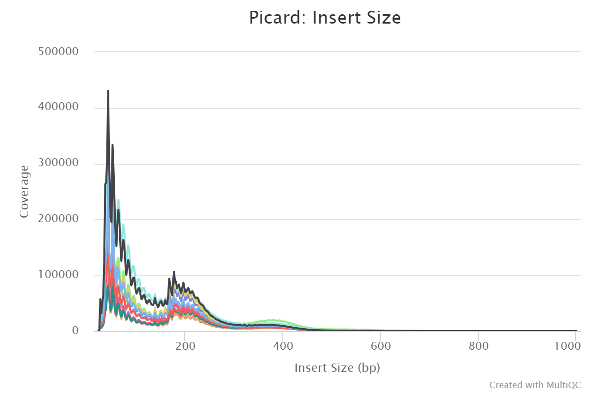
   
   B) Duplication statistics: ~40% of the reads uniquely mapped to human genome
      	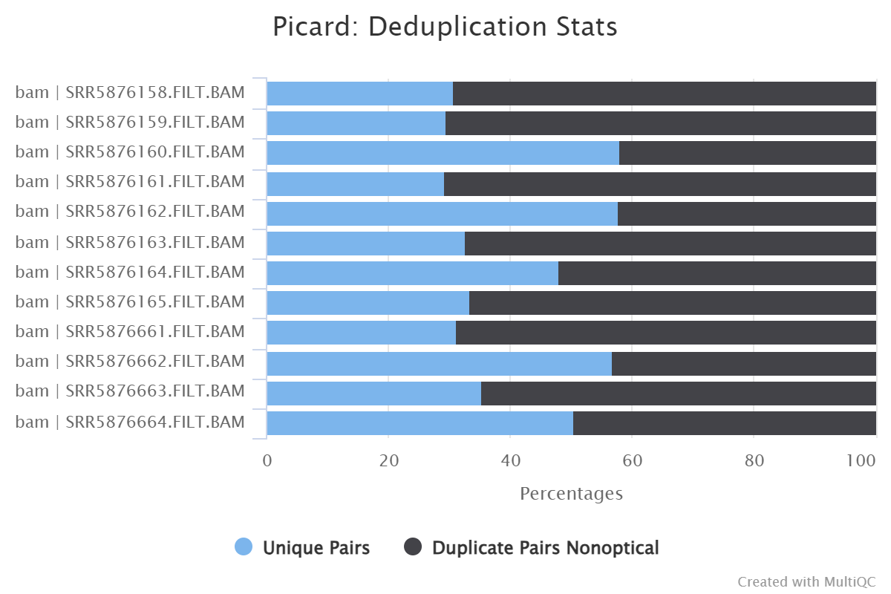
   
   C) FRiP scores: about 30% of the total peaks are found within the peaks
   	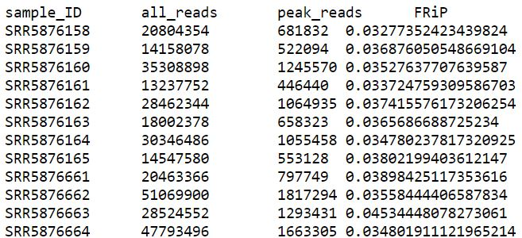

   D) nIDR: Replicates of the same group show consistency.

       	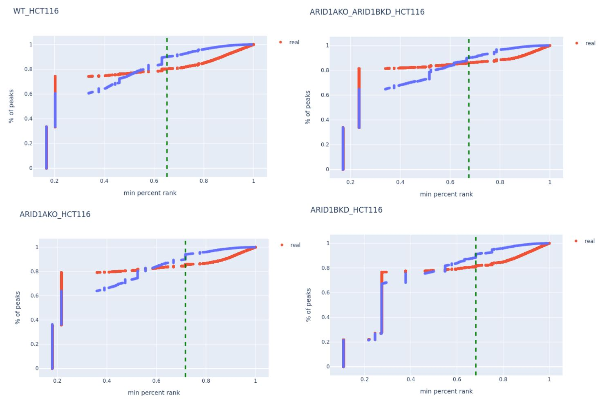
     
        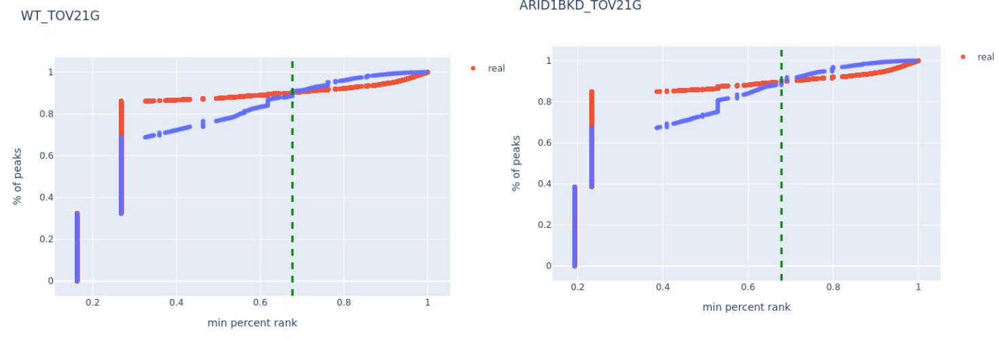

   
   E) PCA plot: clear separation between cell lines with the Principal Component 1 and 2. PC2 clusters HCT116 by treatment.
   *   WT HCT116 cells and ARID1B KD HCT116 cells cluster together. It could be an indication that ARID1B KD does not have a strong effect in chromatin accessibility in WT HCT116 cells.
   *   We predict similar results between ARID1A-mutant TOV21G cells and ARID1B KD TOV21G cells that cluster all together.
     
        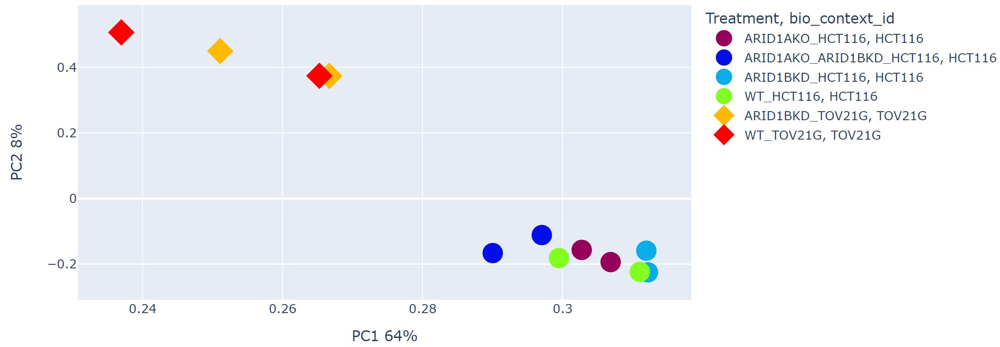

       	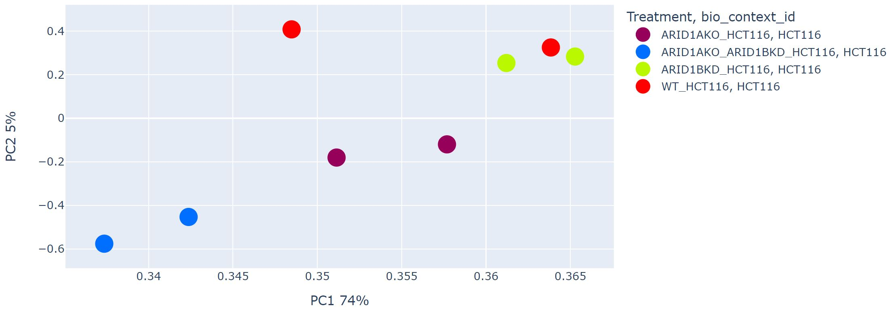
     
        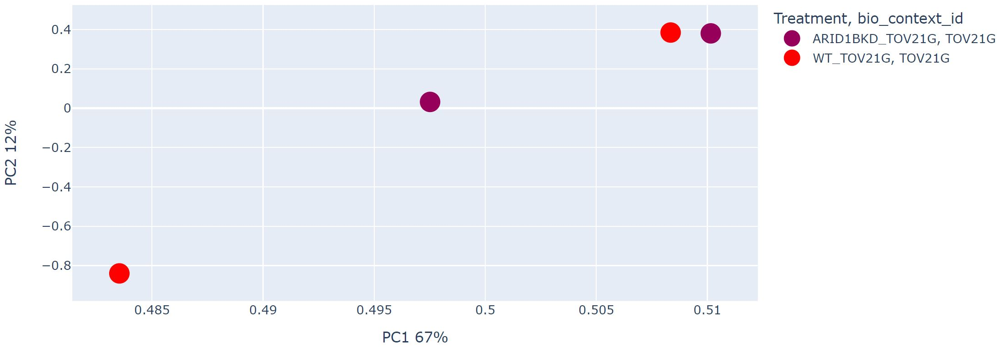
   
  
   
   F) Sample to sample correlation:
   * HCT116 shows more overlap between samples than TOV21G.
   * Again, WT HCT116 cells and ARID1B KD HCT116 cells cluster together and ARID1A-mutant TOV21G cells and ARID1B KD TOV21G cluster together which predicts that these two contrasts will present weak results.
        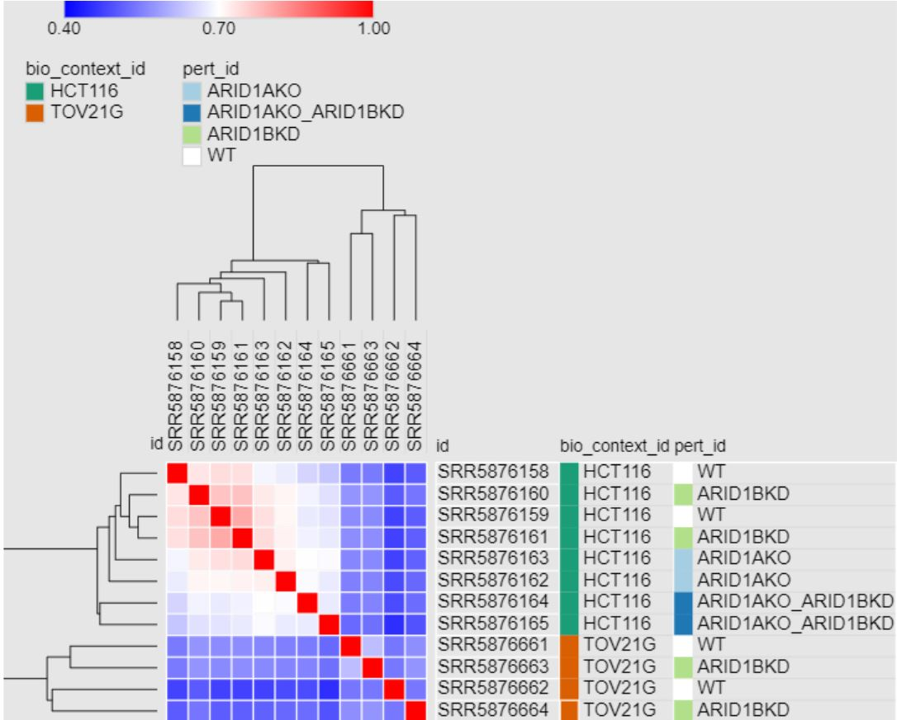
     
        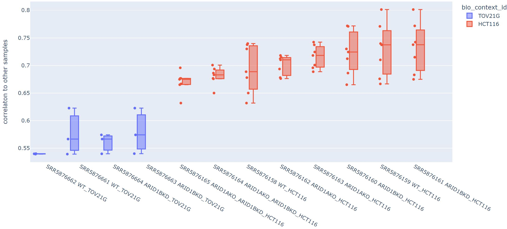
   
   
3) Peak distribution:

   * ARID1A KO in WT HCT116 cells dramatically altered overall chromatin accessibility resulting in thousands of increased and decreased sites.
   * ARID1B KD in WT HCT116 cells had little effect on chromatin accessibility.
   * In contrast, ARID1B KD in ARID1A-/- HCT116 cells resulted in hundreds of changed sites, primarily at regions where accessibility was lost.
   * ARID1A-mutant TOV21G cell line infected with shRNAs to ARID1B (ARID1B KD) showed little effect of chromatin accessibility.
   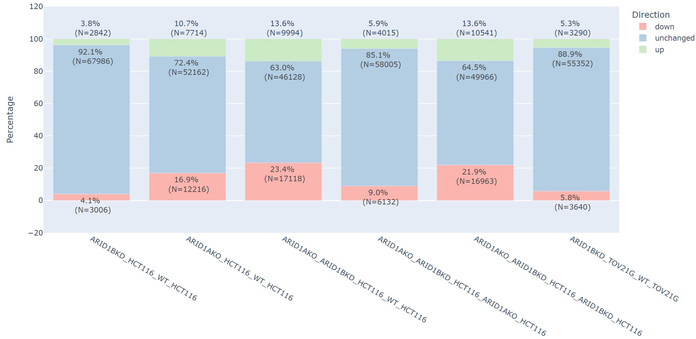

     
4) Genome location: Majority of loss of accessibility occur at distal intergenic regions. Decreased sites are enriched at intronic regions regions while increased sites are enriched at promoters.

   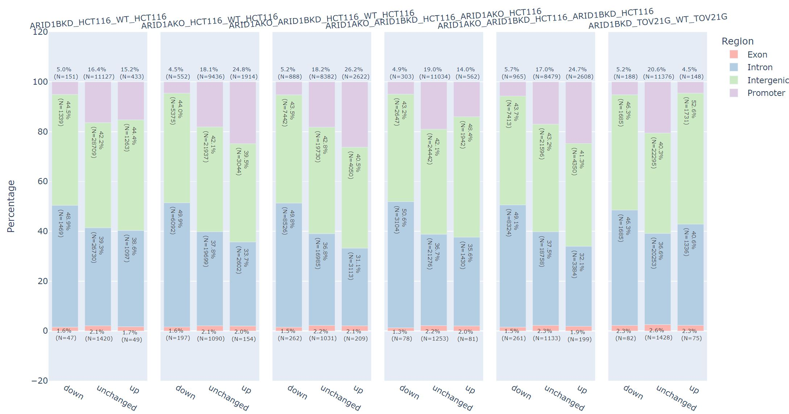

  
     
5) Motif analysis: 
   * Sites losing chromatin accessibility are strongly enriched in the AP-1 family in ARID1A-/- HCT116 cells and relatively highly enriched in ARID1A-mutant TOV21G cell lines over the total number of peaks.
   * However, motifs in ARID1B KD in WT HCT116 cells have low p-values and are mostly in the TEAD family.
  
   

   

   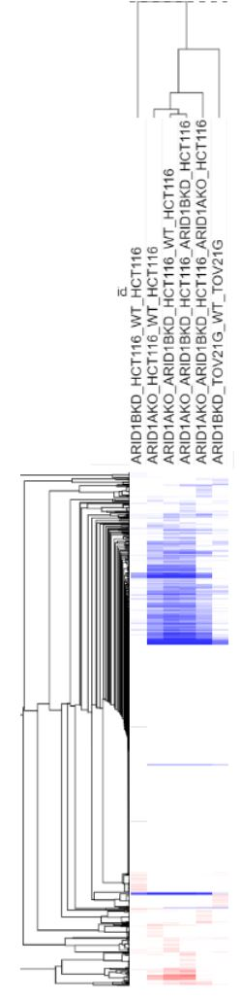

   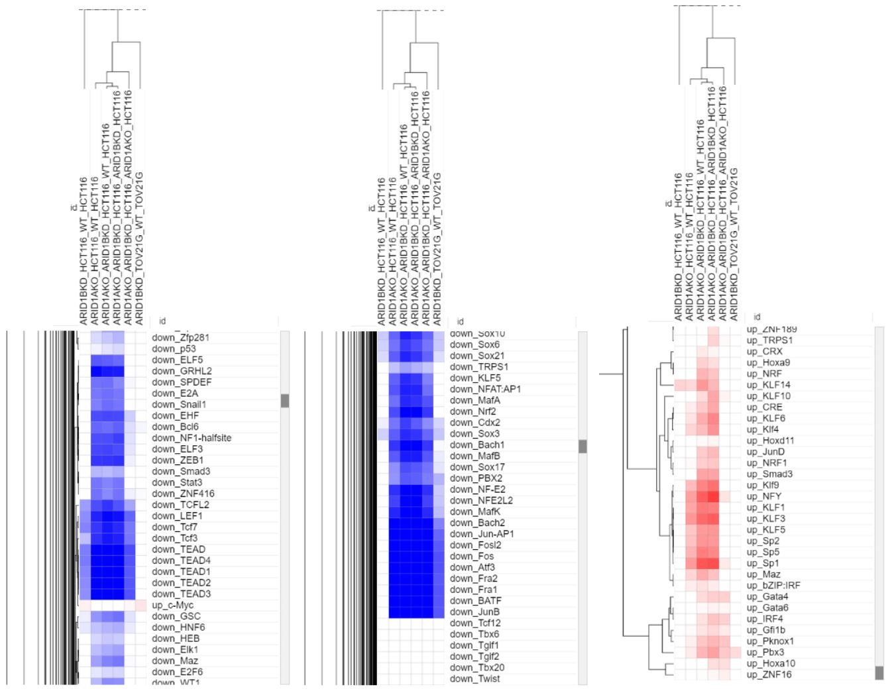

   + ADD SCATTER PLOT OF MOTIFS
     
7) Tornado plot: It is an overall look at the whole data at once looking at a very condensed view, where each row is a peak and the intensity of the color represents the read count.

   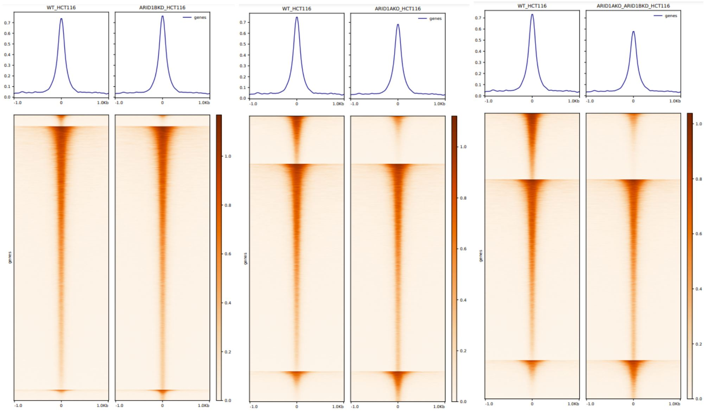

   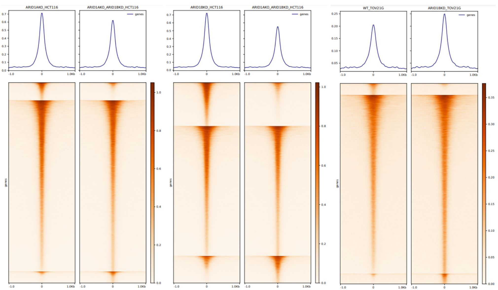

8) Footprinting

+ ADD VOLCANO PLOT, ANCHOR PLOT AND HEATMAP OVERALL

