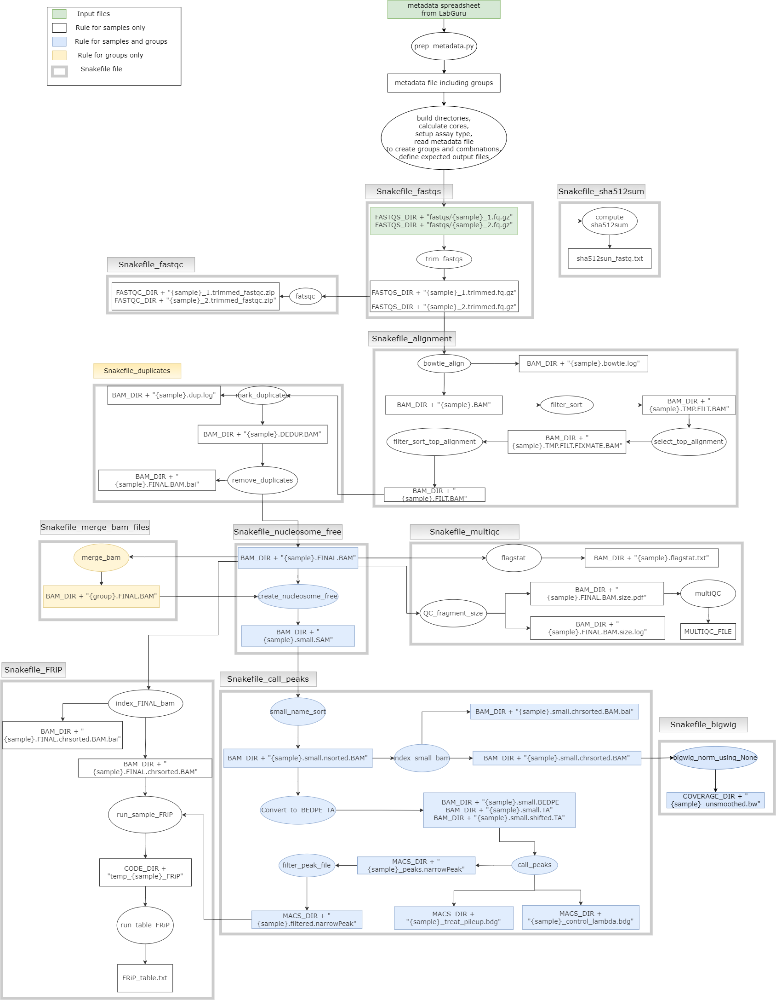

**trim_fastqs**: remove adapter from sequence coming from ATAC-seq process  

**compute sh512sum**: QC measure  

**run fastqc**: quality control checks on raw sequence data   

**bowtie_align**: index the genome to the hg reference into reads  
**filter_sort**: sort by read names  
**select_top_alignment**: select reads with the least amount of mismatch of bp between our sequence and the hg reference  
**filter_sort_top_alignment**: sort reads by chromosomal coordinates  

**mark_duplicates**: mark duplicates  
**remove_duplicates**: remove duplicates  

**QC_fragment_size**: remove reads that are longer that a nucleotide   
**flasgstat**: report number of reads that are alignment with the genome   
**mutliQC**: report flagstat into html report   

**create_nucleosome_free**: additional filter on reads depending on the size of the insert (~120 to obtain more meaningful reads). Removes reads that are too long and that have insert right before and after nucleosomes.   

**small_final_sort**: sort by read names   
**index_small_bam**: sort reads by chromosomal coordinates and index BAM files   
**Convert_to_BEDPE_TA**: get PE (paired end) only focusing on the start and end, add a shift (2 bed columns)   
**call_peaks**: filter denser peaks   
**filter_peaks**: remove chromosome names that are chr1:22 or chrX and chrY   

**big_wig_norm_using_None**: compressed version of BAM file that is representing how dense the signal is in IGV Browser Portal   
